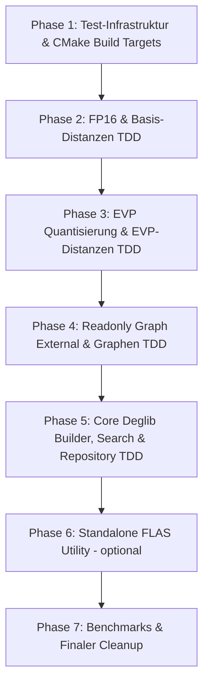

# EVP Integration: Overall Master Plan (TDD)

Dieses Dokument beschreibt die globale Phasenaufteilung zur schrittweisen Integration des `evp`-Branches in `main`.

## TDD Grundprinzipien
1. Jede Phase beginnt **zuerst** mit dem Hinzufügen / Aktivieren der entsprechenden Unit-Tests.
2. Code/Headers werden erst integriert und angepasst, bis die jeweiligen Test-Executables ohne Fehler kompilieren und 100% bestehen.
3. Kein SISAP / HDF5: Der `sisap`-Ordner entfällt komplett.

## Globale Phasenübersicht & Verlinkung der Detailpläne

### [Phase 1: Test-Infrastruktur & CMake Build Targets](file:///c:/Lang/cpp/DynamicExplorationGraph/cpp/docs/evp_integration/phase1_test_infrastructure.md) (✅ ABGESCHLOSSEN - Siehe [Ergebnisse Phase 1](file:///c:/Lang/cpp/DynamicExplorationGraph/cpp/docs/evp_integration/phase1_results.md))

- Einrichtung von `test/CMakeLists.txt`, `DetectCPUFeatures.cmake`, `compile-options` Interface Target.
- Einbinden der Google Test (gtest) Infrastruktur über `external/fmt/test/gtest`.

### [Phase 2: FP16 & Basis-Distanzen TDD](file:///c:/Lang/cpp/DynamicExplorationGraph/cpp/docs/evp_integration/phase2_fp16_and_distances.md)
- Tests: `test_fp16`, `test_fp32_l2`, `test_fp32_inner_product`, `test_fp16_inner_product`, `test_uint8_l2`, `test_config_cascade`.
- Headers: `fp16.h`, `fp32_l2.h`, `fp32_inner_product.h`, `fp16_l2.h`, `fp16_inner_product.h`, `uint8_l2.h`, refaktorierte `distances.h`.

### [Phase 3: EVP Quantisierung & EVP-Distanzen TDD](file:///c:/Lang/cpp/DynamicExplorationGraph/cpp/docs/evp_integration/phase3_evp_quantization.md)
- Tests: `test_evp_quantize`, `test_evp_inner_product`, `test_fp16_evp_asym_inner_product`.
- Headers: `evp_quantize.h`, `evp_inner_product.h`, `fp16_evp_asym_inner_product.h`.

### [Phase 4: Graphenstrukturen (`readonly_graph_external`) TDD](file:///c:/Lang/cpp/DynamicExplorationGraph/cpp/docs/evp_integration/phase4_graph_structures.md)
- Tests: `test_readonly_graph_external`, `test_sizebounded_graph`.
- Headers: `readonly_graph_external.h`, `readonly_graph.h`, `sizebounded_graph.h`.

### [Phase 5: Core Deglib Integration (Builder, Search, Repository) TDD](file:///c:/Lang/cpp/DynamicExplorationGraph/cpp/docs/evp_integration/phase5_core_deglib_integration.md)
- Tests: `test_builder`, `test_search`, `test_filter`, `test_repository`, `test_visited_list_pool`.
- Headers: `builder.h`, `search.h`, `analysis.h`, `repository.h`.
- Cleanup: Entfernen von `cpp/deglib/include_new/`.

### [Phase 6: Standalone FLAS Utility (Optional)](file:///c:/Lang/cpp/DynamicExplorationGraph/cpp/docs/evp_integration/phase6_flas_utility.md)
- Standalone FLAS Sorter (falls benötigt, ohne SISAP/HDF5).

### [Phase 7: Benchmarks & Finaler Cleanup](file:///c:/Lang/cpp/DynamicExplorationGraph/cpp/docs/evp_integration/phase7_benchmarks_cleanup.md)
- `deglib_build_and_test.cpp`, `microbench_fp16_l2.cpp`.
