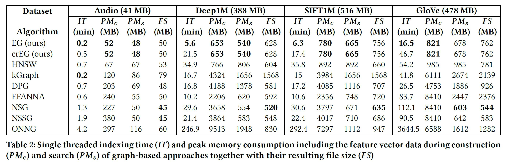

# crEG: An Exploration Graph with Continuous Refinement for Efficient Multimedia Retrieval

The continuous refining Exploration Graph (crEG) is a graph-based approximate nearest neighbor search (ANNS) algorithm. It can index static data set using an incremental extension, a continuous edge optimization. The resulting graph is highly efficient in regards to the queries per seconds in relation to the received recall rate. crEG delivers state-of-the-art performance for indexed and unindexed queries (query is not part of the index). 

## Benchmark datasets incl. exploration queries

| Data set  | Download                 | dimension | nb base vectors | nb query vectors | original website                                               |
|-----------|--------------------------|-----------|-----------------|------------------|----------------------------------------------------------------|
| Audio    |[audio.tar.gz](https://static.visual-computing.com/paper/DEG/audio.tar.gz)| 192       | 53,387       | 200           | [original website](https://www.cs.princeton.edu/cass/)             |           |
| Deep1M    |[deep1m.tar.gz](https://static.visual-computing.com/paper/DEG/deep1m.tar.gz)| 96       | 1,000,000       | 10,000           | [original website](https://research.yandex.com/blog/benchmarks-for-billion-scale-similarity-search)             |
| SIFT1M    |[sift.tar.gz](https://static.visual-computing.com/paper/DEG/sift.tar.gz)| 128       | 1,000,000       | 10,000           | [original website](http://corpus-texmex.irisa.fr/)             |
| GloVe-100 | [glove-100.tar.gz](https://static.visual-computing.com/paper/DEG/glove-100.tar.gz) | 100       | 1,183,514       | 10,000           | [original website](https://nlp.stanford.edu/projects/glove/)   |

## Performance

In order to reproduce our results please checkout the `\cpp\` directory and its readme file. For the four data set above DEG delievered the best ANNS and exploration efficiency amoung all the tested graph-based algorithms.

***NOTE:** All experiments where conduced single threaded on a Ryzen 2700x CPU, operating at a constant core clock speed of 4GHz, and 64GB of DDR4 memory running at 2133MHz.

**Approximate Nearest Neighbor Search**


**Exploratory Search (indexed queries and ideal start seed of for the graph search)**


**Statistics of the graphs used in the experiments**



## Reproduction

Please visit the cpp directory for more information about the parameters settings of the graphs and how to reproduce the crEG values.

## Reference

Please cite our work in your publications if it helps your research:

```
@article{Hezel2023,
  author = {Hezel, Nico and Barthel, Uwe Kai and Schall, Konstantin and Jung, Klaus},
  ee = {https://arxiv.org/abs/2307.10479},
  journal = {CoRR},
  title = {Fast Approximate nearest neighbor search with the Dynamic Exploration Graph using continuous refinement.},
  volume = {abs/2307.10479},
  year = 2023
}
```

