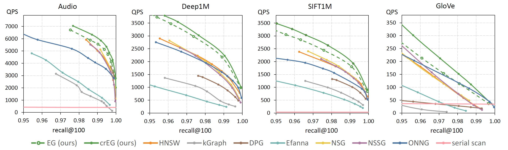
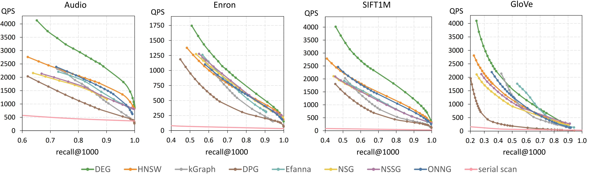

# DEG: Fast Approximate Nearest Neighbor Search

The Dynamic Exploration Graph (DEG) is a graph-based algorithm for approximate nearest neighbor search (ANNS). It indexes both static and dynamic datasets using three algorithms: incremental extension, continuous edge optimization, and vertex deletion. The resulting graph demonstrates high efficiency in terms of queries per second relative to the achieved recall rate. DEG provides state-of-the-art performance for both indexed and unindexed queries (where the query is not part of the index).

## Release

- [2024/05/01] Our paper [An Exploration Graph with Continuous Refinement for Efficient Multimedia Retrieval](https://doi.org/10.1145/3652583.3658117) is accepted by ICMR2024 as **oral presentation**
- [2023/12/02] New continuous refining Exploration Graph (crEG) containing a more efficient and thread-safe way to extend DEG. Currently found in the [crEG branch](https://github.com/Visual-Computing/DynamicExplorationGraph/tree/crEG) of this repository.
- [2023/07/19] First version of Dynamic Exploration Graph is out! For more details please refere to our paper: 
[Fast Approximate nearest neighbor search with the Dynamic Exploration Graph using continuous refinement](https://arxiv.org/abs/2307.10479)

## Benchmark datasets including exploration queries and ground truth data

| Data set  | Download                 | dimension | nb base vectors | nb query vectors | original website                                               |
|-----------|--------------------------|-----------|-----------------|------------------|----------------------------------------------------------------|
| Audio    |[audio.tar.gz](http://static.visual-computing.com/paper/DEG/audio.tar.gz)| 192       | 53,387       | 200           | [original website](https://www.cs.princeton.edu/cass/)             |
| Enron    |[enron.tar.gz](http://static.visual-computing.com/paper/DEG/enron.tar.gz)| 1369       | 94,987       | 200           | [original website](https://www.cs.cmu.edu/~enron/)             |
| SIFT1M    |[sift.tar.gz](http://static.visual-computing.com/paper/DEG/sift.tar.gz)| 128       | 1,000,000       | 10,000           | [original website](http://corpus-texmex.irisa.fr/)             |
| GloVe-100 | [glove-100.tar.gz](http://static.visual-computing.com/paper/DEG/glove-100.tar.gz) | 100       | 1,183,514       | 10,000           | [original website](https://nlp.stanford.edu/projects/glove/)   |

## Performance

In order to reproduce our results please checkout the `\cpp\` directory and its readme file. For the four data set above DEG delievered the best ANNS and exploration efficiency amoung all the tested graph-based algorithms.

***NOTE:** All experiments where conduced single threaded on a Ryzen 2700x CPU, operating at a constant core clock speed of 4GHz, and 64GB of DDR4 memory running at 2133MHz.

**Approximate Nearest Neighbor Search**


**Exploratory Search (indexed queries)**


## Reference

Please cite our work in your publications if it helps your research:

```
@article{Hezel2023,
  author = {Hezel, Nico and Barthel, Uwe Kai and Schall, Konstantin and Jung, Klaus},
  ee = {https://arxiv.org/abs/2307.10479},
  journal = {CoRR},
  title = {Fast Approximate nearest neighbor search with the Dynamic Exploration Graph using continuous refinement.},
  volume = {abs/2307.10479},
  year = 2023
}
```

