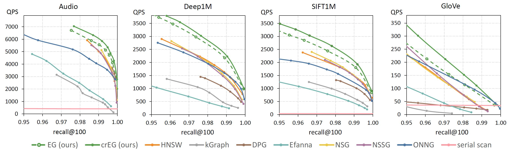
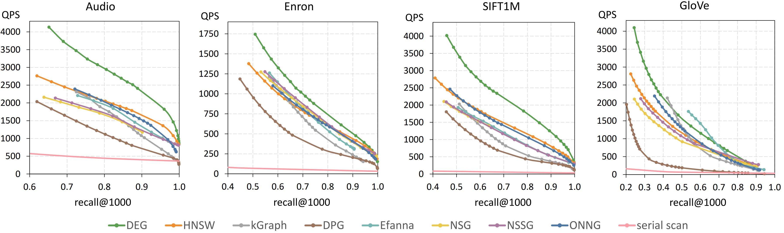

<h1 align="center">Dynamic Exploration Graph (DEG)</h1>
<div align="center">
High-throughput approximate nearest neighbor and exploratory search library implementing continuous edge optimization and dynamic stream indexing (<a href="https://doi.org/10.1007/978-981-96-2054-8_25">MMM '25</a>, <a href="https://doi.org/10.1145/3652583.3658117">ICMR '24</a>).
</div>
<br/>

<div align="center">
    <a href="https://github.com/Visual-Computing/DynamicExplorationGraph/actions/workflows/cpp-ci.yml"></a>
    <a href="https://link.springer.com/chapter/10.1007/978-981-96-2054-8_25"></a>
    <a href="https://dynamic-exploration-graph.readthedocs.io/"></a>
    <a href="https://pypi.org/project/deglib/"></a>
    <a href="https://github.com/Visual-Computing/DynamicExplorationGraph/blob/main/LICENSE"></a>
    <a href="https://github.com/Visual-Computing/DynamicExplorationGraph/stargazers"></a>
</div>


---

- **C++20 header-only library** with native Python bindings (`deglib`)
- **Dynamic streaming**: Incremental addition, removal, and continuous edge optimization
- **Multi-threaded construction** and batch vector search with SIMD acceleration (AVX2, AVX-512, NEON)
- **Supported data types**: `float32`, `uint8`, `float16`
- **Supported metrics**: Euclidean ($L_2$), Inner Product / Cosine, quantized EVP
- **Exploratory graph traversal** and label-filtered nearest neighbor search
- Compact graph serialization and lightweight read-only deployment mode

---

## Getting Started

### Python

Install the module via pip:

```bash
pip install deglib
```

Build a search graph and query nearest neighbors:

```python
import numpy as np
import deglib

# 10,000 vectors with 128 dimensions
data = np.random.randn(10_000, 128).astype(np.float32)
query = np.random.randn(128).astype(np.float32)

# 1. Build search index directly from data
graph = deglib.builder.build_from_data(data, metric=deglib.Metric.FP32_L2)

# 2. Search top-10 nearest neighbors
indices, distances = graph.search(query, k=10, eps=0.1)


print("Top-10 neighbor IDs:", indices)
print("Distances:", distances)

# 3. Save graph for serving
graph.save_graph("index.deg")
```

For incremental dynamic updates (adding / deleting vectors on the fly) and advanced filtering, see the [Python Tutorials](https://dynamic-exploration-graph.readthedocs.io/en/latest/tutorials/building_graphs.html).

---

### C++

`deglib` is a header-only C++20 library. Simply add the `cpp/deglib/include` directory to your project:

```cpp
#include <deglib/deglib.h>
#include <iostream>
#include <vector>
#include <random>

int main() {
    const uint32_t num_vectors = 10'000;
    const uint32_t dims = 128;

    // Generate example feature dataset
    std::mt19937 rng(42);
    std::uniform_real_distribution<float> dist(0.0f, 1.0f);
    std::vector<float> dataset(num_vectors * dims);
    for (auto& val : dataset) val = dist(rng);

    // Build graph index directly from data
    auto graph = deglib::build_from_data(
        std::span<const float>(dataset),
        dims,
        /*labels=*/{},
        /*edges_per_vertex=*/32,
        deglib::distances::Metric::FP32_L2
    );

    // Query top-10 nearest neighbors
    std::vector<float> query(dims);
    for (auto& val : query) val = dist(rng);

    auto results = graph.search(std::span<const float>(query), /*k=*/10, /*eps=*/0.1f);

    for (const auto& match : results) {
        std::cout << "Label: " << match.getIdentifier() 
                  << " | Distance: " << match.getDistance() << "\n";
    }
}
```

For CMake presets, test execution, and C++ benchmarks, see the [C++ README](cpp/readme.md).


---

## Performance

**Approximate Nearest Neighbor Search (ANNS)**: Querying unindexed vectors across various graph exploration margins ($\epsilon$).  


**Exploratory Search (Indexed Queries)**: Navigating from existing indexed vertices to discover immediate neighbor clusters.


---

## Datasets & Pre-built Graphs

The following standard datasets and pre-built graph files are supported in benchmarks and examples:

| Dataset | Dimension | Base Vectors | Query Vectors | Pre-built Graph | Reference |
| :--- | :--- | :--- | :--- | :--- | :--- |
| **SIFT1M** | 128 | 1,000,000 | 10,000 | [sift_128D_L2_DEG30.deg](https://static.visual-computing.com/paper/DEG/sift_128D_L2_DEG30.zip) | [Texmex](http://corpus-texmex.irisa.fr/) |
| **DEEP1M** | 96 | 1,000,000 | 10,000 | [deep1m_96D_L2_DEG30.deg](https://static.visual-computing.com/paper/DEG/deep1m_96D_L2_DEG30.zip) | [PPUDA](https://github.com/facebookresearch/ppuda) |
| **GloVe-100** | 100 | 1,183,514 | 10,000 | [glove_100D_L2_DEG30.deg](https://static.visual-computing.com/paper/DEG/glove_100D_L2_DEG30.zip) | [Stanford GloVe](https://nlp.stanford.edu/projects/glove/) |
| **Audio** | 192 | 53,387 | 200 | *Auto-generated* | [Princeton CASS](https://www.cs.princeton.edu/cass/) |
| **Enron** | 1,369 | 94,987 | 200 | *Auto-generated* | [CMU Enron](https://www.cs.cmu.edu/~enron/) |

> [!NOTE]
> When executing benchmarks or Python examples, datasets are automatically downloaded and prepared on first run.

---

## Citation

If you use the library in an academic context, please consider citing our papers:

> Hezel, N., Barthel, K.U., Schilling, B., Schall, K., Jung, K. Dynamic Exploration Graph: A Novel Approach for Efficient Nearest Neighbor Search in Evolving Multimedia Datasets. MultiMedia Modeling (MMM 2025): 333–347.

```bibtex
@article{Hezel2025,
  author    = {Hezel, Nico and Barthel, Uwe Kai and Schilling, Bruno and Schall, Konstantin and Jung, Klaus},
  title     = {Dynamic Exploration Graph: A Novel Approach for Efficient Nearest Neighbor Search in Evolving Multimedia Datasets},
  booktitle = {MultiMedia Modeling},
  publisher = {Springer Nature},
  pages     = {333--347},
  isbn      = {978-981-96-2054-8},
  year      = {2025}
}
```

> Hezel, N., Barthel, K.U., Schall, K., Jung, K. An Exploration Graph with Continuous Refinement for Efficient Multimedia Retrieval. Proceedings of the 2024 International Conference on Multimedia Retrieval (ICMR '24): 657–665.

```bibtex
@inproceedings{Hezel2024,
  author    = {Hezel, Nico and Barthel, Uwe Kai and Schall, Konstantin and Jung, Klaus},
  title     = {An Exploration Graph with Continuous Refinement for Efficient Multimedia Retrieval},
  booktitle = {Proceedings of the 2024 International Conference on Multimedia Retrieval},
  publisher = {Association for Computing Machinery},
  pages     = {657--665},
  isbn      = {9798400706196},
  doi       = {10.1145/3652583.3658117},
  series    = {ICMR '24},
  year      = {2024}
}
```


---

## License

DEG is available under the [MIT License](LICENSE).
